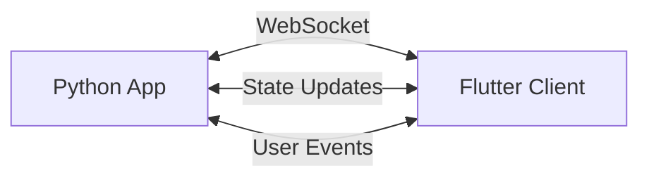

Flet is a framework that allows you to build interactive multi-platform applications in Python without frontend experience. This page explains how Flet works under the hood.

## Client-Server Model

Flet uses a client-server architecture where your Python code runs on the server and communicates with Flutter-based clients:



### How It Works

1. **Server Side**: Your Python application runs the business logic and manages application state
2. **Client Side**: A Flutter-based client renders the UI and handles user interactions
3. **Communication**: Real-time WebSocket connection synchronizes state between server and client

<Note>
In Flet, you write **only Python code**. The framework automatically handles all client-server communication and UI rendering.
</Note>

## Execution Modes

Flet supports multiple execution modes depending on your deployment needs:

<Tabs>
  <Tab title="Desktop App">
    Run as a native desktop application with embedded web view:
    
    ```python
import flet as ft

def main(page: ft.Page):
    page.add(ft.Text("Hello, Desktop!"))

ft.run(main, view=ft.AppView.FLET_APP)
    ```
    
    - Python server runs locally
    - Flutter client embedded in native window
    - Best for desktop applications
  </Tab>
  
  <Tab title="Web Application">
    Run as a web application in the browser:
    
    ```python
import flet as ft

def main(page: ft.Page):
    page.add(ft.Text("Hello, Web!"))

ft.run(main, view=ft.AppView.WEB_BROWSER, port=8000)
    ```
    
    - Python server runs on web server
    - Flutter client runs in browser
    - Multiple concurrent users supported
  </Tab>
  
  <Tab title="Mobile App">
    Package as a native mobile application:
    
    ```python
import flet as ft

def main(page: ft.Page):
    page.add(ft.Text("Hello, Mobile!"))

ft.run(main)
    ```
    
    - Python server embedded in app
    - Flutter client provides native UI
    - Deploy to iOS and Android
  </Tab>
</Tabs>

## Flutter Integration

Flet leverages Flutter for cross-platform UI rendering:

### Why Flutter?

- **Native Performance**: Compiled to native ARM and x64 code
- **Consistent UI**: Same look across all platforms
- **Rich Widgets**: 200+ built-in Material and Cupertino controls
- **Hot Reload**: Fast development cycle (in Flet's case, live updates)

### Control Tree Synchronization

Flet maintains a synchronized control tree between Python and Flutter:

```python
import flet as ft

def main(page: ft.Page):
    # Create control tree in Python
    page.add(
        ft.Column([
            ft.Text("Title"),
            ft.Button("Click me"),
        ])
    )
    # Flet syncs this to Flutter widgets automatically
```

Internally, Flet:
1. Serializes the Python control tree to JSON
2. Sends updates over WebSocket to Flutter client
3. Flutter deserializes and builds corresponding widgets
4. User events flow back to Python event handlers

## WebAssembly Support

Flet supports running Python code in the browser using Pyodide (Python compiled to WebAssembly):

```python
import flet as ft

def main(page: ft.Page):
    page.add(ft.Text("Running in WebAssembly!"))

ft.run(main)
```

### WASM Mode Benefits

- **No server required**: Everything runs in the browser
- **Offline capable**: Works without network connection
- **Static hosting**: Deploy to GitHub Pages, Netlify, etc.
- **Full Python**: Access to Python standard library and packages

<Warning>
WebAssembly mode has some limitations:
- Slower startup time (loading Python runtime)
- Limited access to system resources
- Not all Python packages are compatible
</Warning>

### Detecting WASM Mode

Your app can detect if it's running in WebAssembly mode:

```python
import flet as ft

def main(page: ft.Page):
    if page.wasm:
        page.add(ft.Text("Running in WebAssembly mode"))
    else:
        page.add(ft.Text("Running in standard mode"))

ft.run(main)
```

## Session Management

Each user connection creates a new session:

```python
import flet as ft

def main(page: ft.Page):
    # Each user gets their own page instance
    page.add(ft.Text(f"Session ID: {page.session_id}"))
    
    # Check connection type
    if page.web:
        page.add(ft.Text(f"Client IP: {page.client_ip}"))
        page.add(ft.Text(f"User Agent: {page.client_user_agent}"))

ft.run(main)
```

### Session Lifecycle

1. **Connection**: User opens app → `main(page)` called
2. **Interaction**: Events trigger Python handlers → UI updates sent to client
3. **Disconnect**: User closes app → `page.on_disconnect` called
4. **Cleanup**: Session expires after inactivity (60 minutes default)

### Session Events

```python
import flet as ft

def main(page: ft.Page):
    def on_connect(e):
        print("User connected")
    
    def on_disconnect(e):
        print("User disconnected")
    
    def on_close(e):
        print("Session closed")
    
    page.on_connect = on_connect
    page.on_disconnect = on_disconnect
    page.on_close = on_close

ft.run(main)
```

## Platform Detection

Detect which platform your app is running on:

```python
import flet as ft

def main(page: ft.Page):
    # Platform detection
    platform = page.platform
    
    if platform == ft.PagePlatform.IOS:
        page.add(ft.Text("Running on iOS"))
    elif platform == ft.PagePlatform.ANDROID:
        page.add(ft.Text("Running on Android"))
    elif platform == ft.PagePlatform.MACOS:
        page.add(ft.Text("Running on macOS"))
    elif platform == ft.PagePlatform.WINDOWS:
        page.add(ft.Text("Running on Windows"))
    elif platform == ft.PagePlatform.LINUX:
        page.add(ft.Text("Running on Linux"))
    
    # Other platform checks
    if page.web:
        page.add(ft.Text("Running in web browser"))
    if page.pwa:
        page.add(ft.Text("Running as PWA"))

ft.run(main)
```

## Performance Considerations

### Update Batching

Flet batches multiple control updates into a single message:

```python
import flet as ft

def main(page: ft.Page):
    # Manual batching
    txt1 = ft.Text("Line 1")
    txt2 = ft.Text("Line 2")
    txt3 = ft.Text("Line 3")
    
    page.add(txt1, txt2, txt3)
    
    # Update multiple controls at once
    txt1.value = "Updated 1"
    txt2.value = "Updated 2"
    txt3.value = "Updated 3"
    page.update()  # Single batch update
```

### Threading

Run background tasks without blocking the UI:

```python
import flet as ft
import time

def main(page: ft.Page):
    progress = ft.ProgressBar()
    page.add(progress)
    
    def long_running_task():
        for i in range(100):
            progress.value = i / 100
            page.update()
            time.sleep(0.1)
    
    # Run in background thread
    page.run_thread(long_running_task)

ft.run(main)
```

### Async Support

Use async/await for asynchronous operations:

```python
import flet as ft
import asyncio

async def main(page: ft.Page):
    async def fetch_data():
        await asyncio.sleep(2)  # Simulate API call
        return "Data loaded!"
    
    result = ft.Text("Loading...")
    page.add(result)
    
    data = await fetch_data()
    result.value = data
    page.update()

ft.run(main)
```

## Next Steps

<CardGroup cols={2}>
  <Card title="Page and Controls" icon="cube" href="/concepts/page-and-controls">
    Learn about the Page object and control hierarchy
  </Card>
  <Card title="Events and State" icon="bolt" href="/concepts/events-and-state">
    Understand event handling and state management
  </Card>
</CardGroup>
