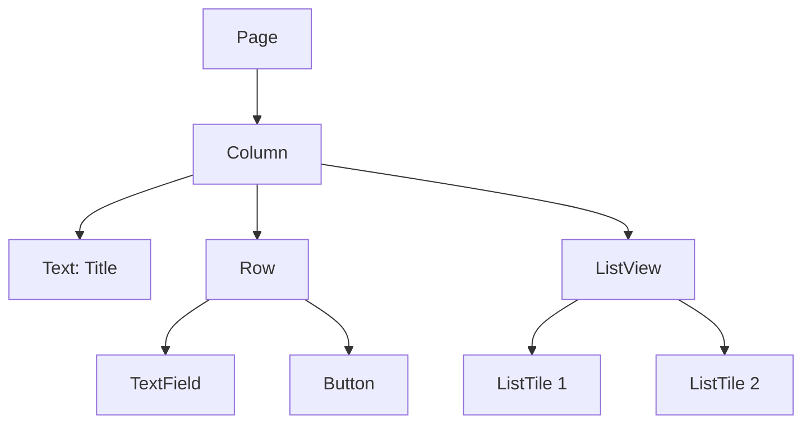

In Flet, everything revolves around the **Page** object and **Controls**. This page explains these fundamental concepts and how they work together.

## The Page Object

The `Page` is the top-level container for your application. Every Flet app receives a `Page` instance in the `main` function:

```python
import flet as ft

def main(page: ft.Page):
    page.title = "My App"
    page.add(ft.Text("Hello, World!"))

ft.run(main)
```

### Page Properties

The Page object provides numerous properties to configure your app:

```python
import flet as ft

def main(page: ft.Page):
    # Window configuration
    page.title = "My Application"
    page.window.width = 800
    page.window.height = 600
    page.window.resizable = True
    
    # Layout configuration
    page.vertical_alignment = ft.MainAxisAlignment.CENTER
    page.horizontal_alignment = ft.CrossAxisAlignment.CENTER
    page.padding = 20
    page.spacing = 10
    
    # Scrolling
    page.scroll = ft.ScrollMode.AUTO
    
    # Theme
    page.theme_mode = ft.ThemeMode.LIGHT
    page.theme = ft.Theme(color_scheme_seed=ft.Colors.BLUE)
    
    page.add(ft.Text("Configured page!"))

ft.run(main)
```

### Page Methods

Common Page methods for managing your app:

<Tabs>
  <Tab title="add()">
    Add controls to the page:
    
    ```python
import flet as ft

def main(page: ft.Page):
    page.add(
        ft.Text("First control"),
        ft.Button("Second control"),
        ft.TextField(label="Third control")
    )
    ```
  </Tab>
  
  <Tab title="update()">
    Push changes to the client:
    
    ```python
import flet as ft

def main(page: ft.Page):
    txt = ft.Text("Count: 0")
    page.add(txt)
    
    def increment(e):
        count = int(txt.value.split()[-1])
        txt.value = f"Count: {count + 1}"
        page.update()  # Push changes
    
    page.add(ft.Button("Increment", on_click=increment))
    ```
  </Tab>
  
  <Tab title="clean()">
    Remove all controls:
    
    ```python
import flet as ft

def main(page: ft.Page):
    page.add(
        ft.Text("This will be cleared"),
        ft.Button("Clear all", on_click=lambda e: page.clean())
    )
    ```
  </Tab>
  
  <Tab title="show_dialog()">
    Display dialogs and modals:
    
    ```python
import flet as ft

def main(page: ft.Page):
    def show_alert(e):
        dialog = ft.AlertDialog(
            title=ft.Text("Alert"),
            content=ft.Text("This is an alert dialog"),
        )
        page.show_dialog(dialog)
    
    page.add(ft.Button("Show Alert", on_click=show_alert))
    ```
  </Tab>
</Tabs>

### Read-Only Properties

Some Page properties provide runtime information:

```python
import flet as ft

def main(page: ft.Page):
    info = []
    
    # Platform information
    info.append(f"Platform: {page.platform}")
    info.append(f"Web: {page.web}")
    info.append(f"PWA: {page.pwa}")
    info.append(f"WASM: {page.wasm}")
    info.append(f"Debug: {page.debug}")
    
    # Web-specific (if applicable)
    if page.web:
        info.append(f"Client IP: {page.client_ip}")
        info.append(f"User Agent: {page.client_user_agent}")
    
    # Dimensions
    info.append(f"Width: {page.width}")
    info.append(f"Height: {page.height}")
    
    # Current route
    info.append(f"Route: {page.route}")
    
    for text in info:
        page.add(ft.Text(text))

ft.run(main)
```

## Control Classes

All UI elements in Flet inherit from the `Control` base class:

```python
# From flet/controls/control.py
@dataclass(kw_only=True)
class Control(BaseControl):
    """Base class for controls."""
    
    expand: Optional[Union[bool, int]] = None
    expand_loose: bool = False
    col: ResponsiveNumber = 12
    opacity: Number = 1.0
    tooltip: Optional[TooltipValue] = None
    badge: Optional[BadgeValue] = None
    visible: bool = True
    disabled: bool = False
    rtl: bool = False
```

### Common Control Properties

All controls share these properties:

```python
import flet as ft

def main(page: ft.Page):
    # Visibility
    visible_btn = ft.Button("Visible", visible=True)
    hidden_btn = ft.Button("Hidden", visible=False)
    
    # Disabled state
    enabled_btn = ft.Button("Enabled", disabled=False)
    disabled_btn = ft.Button("Disabled", disabled=True)
    
    # Opacity
    opaque = ft.Container(
        content=ft.Text("Opaque"),
        bgcolor=ft.Colors.BLUE,
        opacity=1.0,
        padding=10,
    )
    transparent = ft.Container(
        content=ft.Text("Transparent"),
        bgcolor=ft.Colors.BLUE,
        opacity=0.3,
        padding=10,
    )
    
    # Tooltip
    with_tooltip = ft.Button(
        "Hover me",
        tooltip="This is a helpful tooltip"
    )
    
    # Expansion
    page.add(
        ft.Row([
            ft.Container(content=ft.Text("Fixed"), bgcolor=ft.Colors.BLUE),
            ft.Container(content=ft.Text("Expand"), bgcolor=ft.Colors.RED, expand=True),
        ])
    )

ft.run(main)
```

### Control Lifecycle

1. **Creation**: Control instance created in Python
2. **Addition**: Control added to parent (page or container)
3. **Update**: Properties modified, `update()` called
4. **Removal**: Control removed from parent

```python
import flet as ft

def main(page: ft.Page):
    # 1. Creation
    btn = ft.Button("Click me")
    
    # 2. Addition
    page.add(btn)
    
    # 3. Update
    def change_text(e):
        btn.text = "Clicked!"
        btn.update()  # Or page.update(btn)
    
    btn.on_click = change_text
    
    # 4. Removal (example)
    def remove_button(e):
        page.remove(btn)
    
    page.add(ft.Button("Remove first button", on_click=remove_button))

ft.run(main)
```

## The Control Tree

Flet apps are structured as a hierarchical tree of controls:



### Building Control Trees

Create nested control structures:

```python
import flet as ft

def main(page: ft.Page):
    page.add(
        ft.Column([
            ft.Text("Login Form", size=24, weight=ft.FontWeight.BOLD),
            ft.TextField(label="Username", autofocus=True),
            ft.TextField(label="Password", password=True),
            ft.Row([
                ft.FilledButton("Login"),
                ft.TextButton("Cancel"),
            ], alignment=ft.MainAxisAlignment.END),
        ], spacing=20, width=400)
    )

ft.run(main)
```

### Container Controls

Common controls that contain other controls:

<CardGroup cols={2}>
  <Card title="Column" icon="grip-lines">
    Arranges children vertically
    
    ```python
    ft.Column([
        ft.Text("Item 1"),
        ft.Text("Item 2"),
    ])
    ```
  </Card>
  
  <Card title="Row" icon="grip-lines-vertical">
    Arranges children horizontally
    
    ```python
    ft.Row([
        ft.Icon(ft.Icons.STAR),
        ft.Text("Favorite"),
    ])
    ```
  </Card>
  
  <Card title="Container" icon="square">
    Single-child container with styling
    
    ```python
    ft.Container(
        content=ft.Text("Styled"),
        bgcolor=ft.Colors.BLUE,
        padding=20,
        border_radius=10,
    )
    ```
  </Card>
  
  <Card title="ListView" icon="list">
    Scrollable list of items
    
    ```python
    ft.ListView([
        ft.ListTile(title=ft.Text("Item 1")),
        ft.ListTile(title=ft.Text("Item 2")),
    ])
    ```
  </Card>
</CardGroup>

### Accessing Child Controls

Navigate and modify the control tree:

```python
import flet as ft

def main(page: ft.Page):
    # Create a container with children
    container = ft.Column([
        ft.Text("Item 1", key="text1"),
        ft.Text("Item 2", key="text2"),
        ft.Button("Click", key="btn"),
    ])
    
    page.add(container)
    
    # Access children
    first_child = container.controls[0]
    print(f"First child: {first_child.value}")  # "Item 1"
    
    # Modify children
    def update_items(e):
        container.controls[0].value = "Updated!"
        container.update()
    
    container.controls[2].on_click = update_items

ft.run(main)
```

## Control References

Use `Ref` to access controls without direct variable references:

```python
import flet as ft

def main(page: ft.Page):
    # Create references
    username_ref = ft.Ref[ft.TextField]()
    password_ref = ft.Ref[ft.TextField]()
    
    def login_click(e):
        # Access controls via refs
        print(f"Username: {username_ref.current.value}")
        print(f"Password: {password_ref.current.value}")
    
    page.add(
        ft.Column([
            ft.TextField(ref=username_ref, label="Username"),
            ft.TextField(ref=password_ref, label="Password", password=True),
            ft.FilledButton("Login", on_click=login_click),
        ])
    )

ft.run(main)
```

## Update Strategies

Different ways to update the UI:

### Update Entire Page

```python
import flet as ft

def main(page: ft.Page):
    count_text = ft.Text("0")
    
    def increment(e):
        count_text.value = str(int(count_text.value) + 1)
        page.update()  # Updates entire page
    
    page.add(count_text, ft.Button("Add", on_click=increment))
```

### Update Specific Controls

```python
import flet as ft

def main(page: ft.Page):
    count_text = ft.Text("0")
    
    def increment(e):
        count_text.value = str(int(count_text.value) + 1)
        count_text.update()  # Updates only this control
    
    page.add(count_text, ft.Button("Add", on_click=increment))
```

### Update Multiple Controls

```python
import flet as ft

def main(page: ft.Page):
    txt1 = ft.Text("0")
    txt2 = ft.Text("0")
    
    def increment_both(e):
        txt1.value = str(int(txt1.value) + 1)
        txt2.value = str(int(txt2.value) + 1)
        page.update(txt1, txt2)  # Updates both controls
    
    page.add(txt1, txt2, ft.Button("Add", on_click=increment_both))
```

<Note>
For better performance, update only the controls that changed rather than the entire page.
</Note>

## Control IDs and Keys

Identify controls using IDs or keys:

```python
import flet as ft

def main(page: ft.Page):
    # Using data attribute
    page.add(
        ft.Column([
            ft.Button("Button 1", data="btn1"),
            ft.Button("Button 2", data="btn2"),
            ft.Button("Button 3", data="btn3"),
        ])
    )
    
    # Using key attribute
    page.add(
        ft.TextField(label="Email", key="email_input")
    )
    
    # Get control by internal ID
    btn_instance = page.get_control(1)  # By internal ID

ft.run(main)
```

## Next Steps

<CardGroup cols={2}>
  <Card title="Events and State" icon="bolt" href="/concepts/events-and-state">
    Learn how to handle user interactions and manage state
  </Card>
  <Card title="Routing" icon="route" href="/concepts/routing">
    Implement navigation and routing in your app
  </Card>
</CardGroup>
